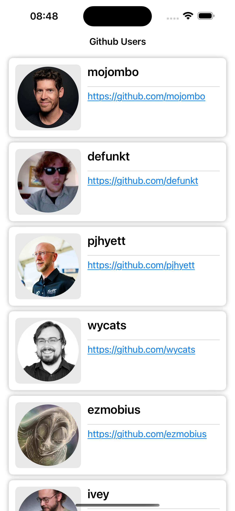
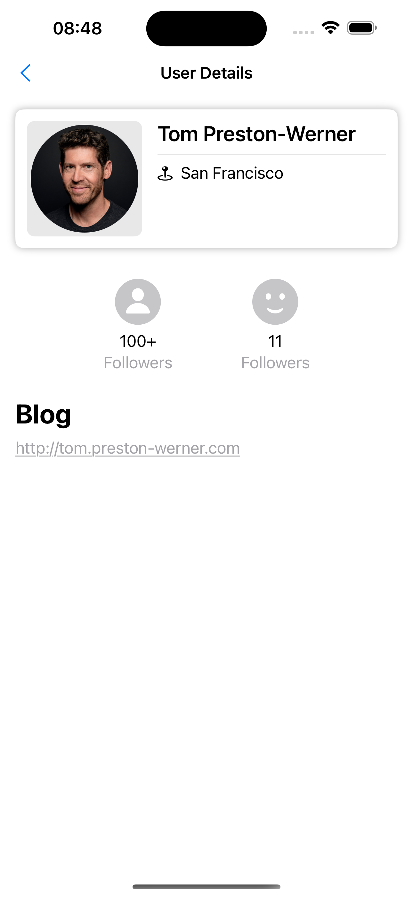
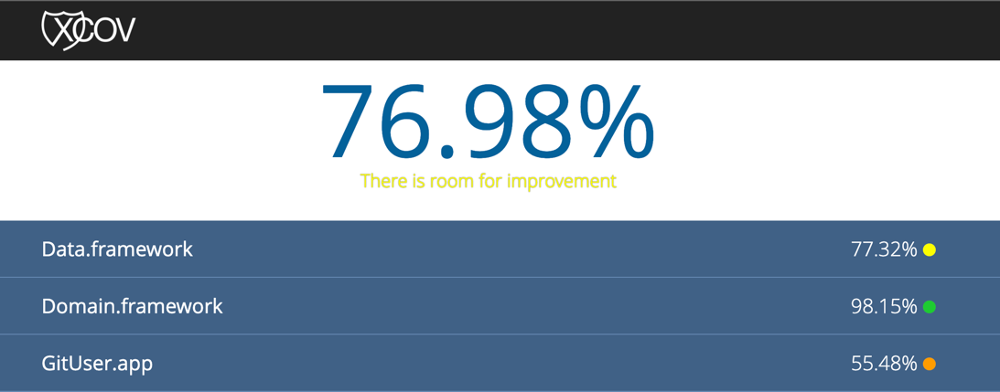

# iOS-Swift

## Screenshots
| User List | User Detail|
|-|-|
|  |  |

## Code Coverage Report
Run: Command + U

## Bitrise: 
Project: ...

## Requirements

- Ruby `3.1.2`
- Xcode `15+`

## Install Dependencies

- `bundle install`
- `bundle exec pod install`

Build with Xcode.
